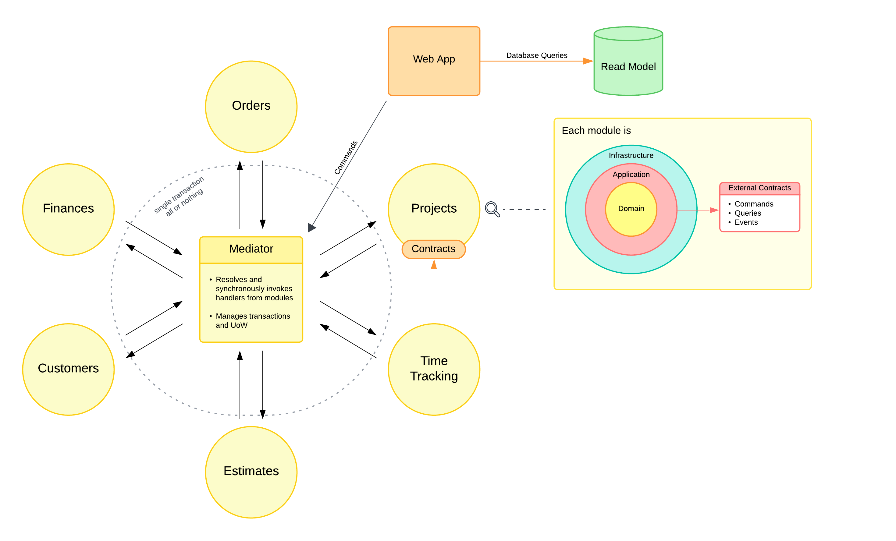

# Modular.StarterTemplate
Starter template for a modular application in Clean Architecture DDD style with synchronous interaction between modules within single transaction. Perfect for ERP applications.

# Architecture diagram

# Description
* The solution consists of a framework, that provides building blocks of Clean Architecture components and Domain-Driven Design (DDD) patterns, and a basic web application built with it.
* The framework also provides a module factory that builds, configures, and starts individual modules.
* Each module built in this manner has its own composition root with independent DI container.
* All interactions between them are synchroniosly performed via [mediator](https://refactoring.guru/design-patterns/mediator) (not MediatR!).
* Each module exposes its external contracts in a separate assembly, which other modules can depend on. These contracts consist basically of commands, events, and queries that are passed to the mediator.
* I intentionally avoided asynchronous interactions between modules, as I prioritized consistency and atomicity in all operations and do not anticipate a high level of concurrent operations on the same domain objects.
* Consequently, all operations are performed in a single transaction. The first handler initiates the transaction, which subsequent handlers then reuse for their DbContexts.
* However, asynchronous invocation can be implemented if needed.
* Transaction, Unit of Work, and Domain Events management are implemented with handler decorators in the infrastructure layer, keeping the application layer free from infrastructure concerns, which simplifies unit testing of the handlers.
* In the project module of the example application, I use lazy loading for the aggregate entities. This approach prevents loading the entire graph for each operation, optimizing for performance and concurrency, also I cannot logically split this aggregate, as I expect these entities to be highly interdependent in many use cases. I prefer completeness, encapsulation, and simplicity until it causes any issues. [Read this for explanation](https://enterprisecraftsmanship.com/posts/domain-model-purity-lazy-loading/)
* The web application (for displaying data on pages) and various reporting services can read data from the database via a scaffolded Read Model, which provides `DataQuery` abstraction for building arbitrary queries with the model.
* Each module has access only to its own DbContext bounded by its database-schema.

# TO-DO
* Add a queue for I/O operations which should be performed outside the transaction, e.g. building and saving pdf-reports.
